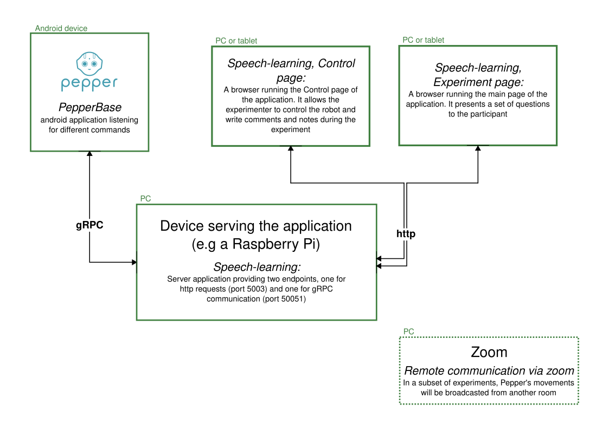

# General Architecture

This experiment requires multiple devices to communicate and coordinate different actions.
To do so, the speech-learning application has been developed as a central location for all
interactions between devices, including communicating with Pepper and providing interactive
webpages to run the experiment, send commands to the robot and provide extra information about the
experiment.

In the following image, we can see a scheme of the elements required for this experiment:

There are three main parts to the code required to run this experiment, which can at the same time
be divided into two groups.

First, there is a Flask web server that works as the central part of the application.
It provides the web apps used in the participant and experimenter screens, as well as managing the
communication with Pepper (to request and monitor the execution of different commands).

The main web app is defined in the `client` folder and consists of a React app with routing set
to provide two different views depending on whether the experiment or control page is required.

Finally, to control the robot, Pepper needs to be running the
[PepperBase](https://github.com/NaoPepper4hri/PepperBase) application.
This application opens a gRPC stream with the `speech-learning` server and executes the commands
sent on this stream.
This allows controlling the robot remotely, without the need of creating a specific Android app for
this experiment.
The commands allowed are described by a [gRPC description](../protos/pepper_command.proto) of the
service, and include:

- Animation selection: Execute a predefined animation in the app.
- Text to speech: Send a string of text for Pepper to say out loud.
- 2D translation: Request Pepper to move to a global (with reference the start position of the
  robot) or relative pose.
- Autonomous abilities: Enable or disable basic awareness, background movements and blinking.

### Required Hardware

Besides Pepper and the computer running the speech-learning server, two laptops or tablets are
necessary to present the experiment page to the participant and the control page to the
experimenter.
It could also be possible to use the same computer to run the server and show one of the two pages.
Any device with a browser can be used to show the experiment (PCs, tablets or phones).

This architecture also allows us to bring the experiment outside the lab.
Using a Raspberry Pi as a WiFi hotspot hosting the server, we can easily run the experiment in
locations without internet access, using small, easily accessible devices like two tablets to show
the experiment page and control the robot.

### Networking

In general, the experiment doesn't require internet access.
However, in the case of the second part of this experiment (an online interaction between the
participant and Pepper), we need the devices showing the experiment and control pages to have
access to both the server and the internet.
